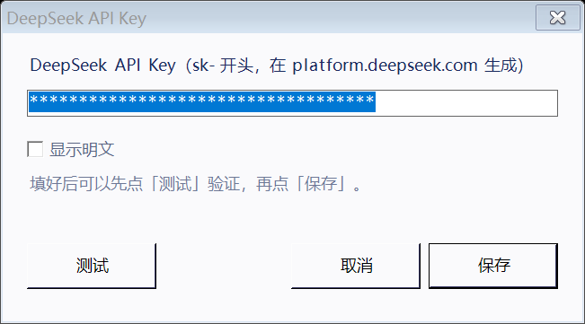

# DeepSeek 余额挂件

一个贴在桌面上的小挂件，随时告诉你 DeepSeek 账户还剩多少钱、现在是高峰还是空闲时段。

点一下刷新余额，拖到任务栏旁边会自动吸附。**单文件 exe，不需要装 Python / Node / 任何运行库。**


## 功能

- 💰 **余额**：点击角色立刻查一次 `api.deepseek.com/user/balance`，数字带滚动动画
- 📊 **今日已用**：按余额差值记账，跨天自动归零，充值也会自动重置基准
- ⛰️ **计价时段**：点两下看当前是空闲时段还是高峰时段
- 💸 **什么时候更便宜**：点三下看下一个空闲时段从几点开始、还剩多久
- 🖱️ **任务栏吸附**：拖到任务栏或屏幕边缘附近松手会自动贴上去
- 🎬 **动画**：平时完全静止（贴任务栏不会飘），点击时弹簧弹跳、查询时转圈、出结果绿圈扩散
- ⚙️ **API Key 输入界面**：右键就能改，带连通性测试，不用手改配置文件

## 截图

| 当前时段（点两下） | 什么时候便宜（点三下） |
| --- | --- |
|  |  |

| 第一次启动填 Key | 还没填 Key 时 |
| --- | --- |
|  |  |

## 使用

1. 下载本仓库 `release/` 目录里的压缩包，解压到固定位置（别放临时目录 / 下载目录）
2. 双击运行，第一次会自动弹出 **API Key 输入框**
3. 把 `sk-` 开头的 Key 粘进去，先点「测试」确认连通，再点「保存」
4. 角色出现在屏幕正中间，可以拖到任意位置

API Key 在 [platform.deepseek.com](https://platform.deepseek.com) 生成。

### 点击手势

| 操作 | 效果 |
| --- | --- |
| 点一下 | 刷新余额 |
| 点两下 | 当前计价时段（空闲 / 高峰） |
| 点三下 | 什么时候更便宜、还剩多久 |
| 点四下 | 回到余额 |
| 拖动 | 移动，靠近任务栏会自动吸附 |
| 右键 | 打开菜单 |

### 计价时段规则

按 DeepSeek 官方定价：

| 时段 | 单价 |
| --- | --- |
| 工作日 09:00–12:00、14:00–18:00 | 高峰价（翻倍） |
| 工作日其余时间 | 空闲价（减半） |
| 周六、周日全天 | 空闲价 |

## 配置

程序目录下的 `config.json`（首次运行自动生成，也可以照 `config.example.json` 手写）：

| 字段 | 说明 |
| --- | --- |
| `api_key` | DeepSeek API Key |
| `api_base` | 接口地址，默认 `https://api.deepseek.com` |
| `scale` | 大小，0.4–2.5，默认 0.7 |
| `always_on_top` | 是否置顶，默认 `true` |
| `auto_refresh_seconds` | 自动刷新间隔秒数，0 = 只手动刷新 |
| `snap_enabled` | 拖动后是否自动吸附边缘 |
| `snap_distance` | 吸附触发距离（像素） |
| `start_centered` | 启动时是否居中显示 |
| `character_png` | 自定义角色图路径，留空用内置的 |

## 自己编译

只需要 Windows 自带的 .NET Framework 编译器（Win10/11 自带，不用额外装东西）：

```cmd
build.cmd
```

编译脚本会先用 `src\IconTool.cs` 重新生成图标资源，再编译出 `DeepSeekBalanceWidget.exe`。

## 常见问题

**窗口不见了？**
按 F5 刷新桌面；还不行就把 `config.json` 里的 `"x"` `"y"` 改成 `null` 再启动。
每次启动都会往 `widget.log` 写一行 `窗口位置 x,y`，排查很方便。

**显示"查询失败"？**
右键 → 设置 API Key… → 点「测试」看具体报错。

**杀软报毒？**
这是未签名的自编译程序，可能被误报。程序不写注册表、不装服务/驱动、不设开机启动、不开监听端口、不复制自身；
它只读同目录的 `config.json`、访问 `api.deepseek.com`、在自身目录写日志。加个排除项即可。

**API Key 安全吗？**
Key 明文存在本机 `config.json` 里。这个文件已经在 `.gitignore` 里，不会被提交。

## 致谢

角色形象（DS 娘）来自 [MeteorNOX/DeepSeek-Balance-Whale-Widget](https://github.com/MeteorNOX/DeepSeek-Balance-Whale-Widget)（MIT License）。
本项目只做桌面挂件实现，与 DeepSeek 官方无关。

## 许可证

[MIT](LICENSE)
